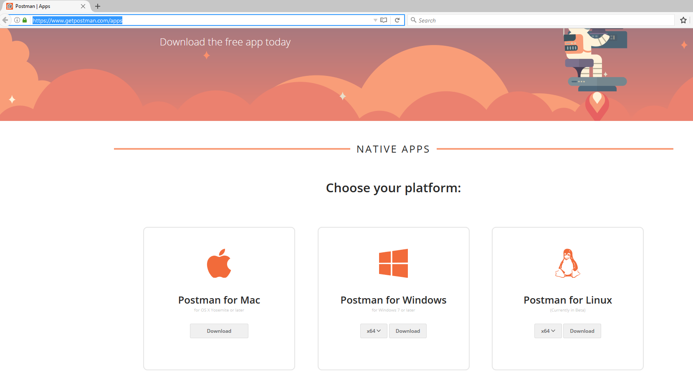
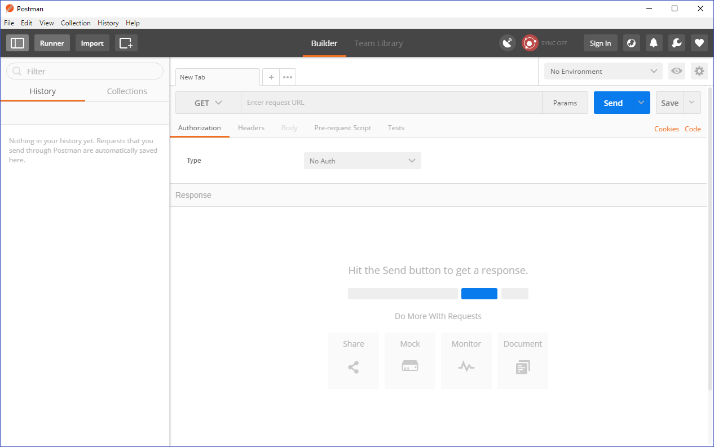

 

Update: July 27, 2017

# APIPCS / ICS Integration Workshop Prerequisites

## Required 3rd Party Testing Tools

### Install Postman

<<<<<<< HEAD
We will use Postman to test the API and the policies configured within APIPCS that integrates with a simple integration flow running within ICS.

If you don’t have Postman installed on your laptop, you will need to install it.
=======
We will use SoapUI to test an ICS Soap Web Service integration.
If you don't already have SoapUI installed on your workstation, you'll need to install it.
>>>>>>> 03b8cc81dc56320817c3200ca8df1f95b8fded73

To install Postman for testing API and ICS integration, follow these instructions:

- Download Postman Native Apps for your laptop platform from the following URL:   
<https://www.getpostman.com/apps>

- Save the download file to a temporary directory on your workstation.

- Run the installer from the temporary directory

- Postman will start when the installation is completed

- If you get the Postman UI above, select “Take me straight to the app” link

- Refer to this link for more information on Postman installation: <https://www.getpostman.com/docs/postman/launching_postman/installation_and_updates> 

---

## Supported Browsers

Most modern browsers including Chrome, Safari, Internet Explorer, Edge and Firefox are supported.

