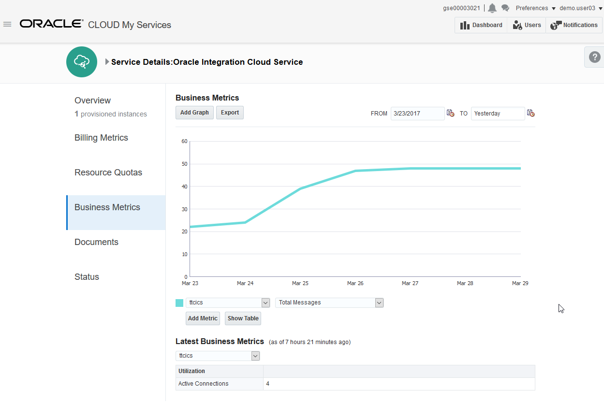
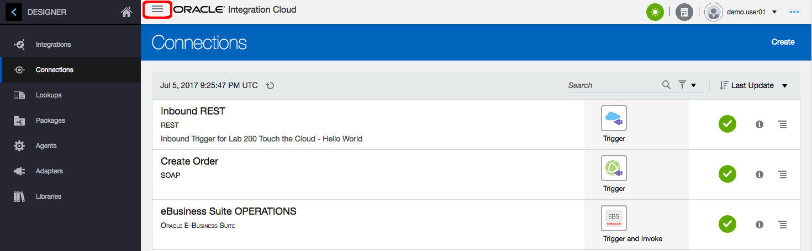

Update: March 30, 2017

# Lab 100 - Integration Cloud Service

---

## Objectives

- Using Integration Cloud Service (ICS) to create an API to be consumed by APIPCS.

## Required Artifacts

- The following lab and an Oracle Public Cloud account that will be supplied by your instructor.

## Introduction

This is the first of several labs that are part of the **APIPCS/ICS Integration Workshop** workshop. 

In this lab, we will create a generic API, in Integration Cloud Service (ICS) to be consumed by the API Platform Cloud Service (APIPCS).  You will acquire a good overview of the Oracle Integration Cloud Service (ICS), the next generation integration platform. You will explore various consoles and tools available to interact with your integration. The exercise will get your familiar with all the tooling available to work with this cloud service. 

We’ll look at the following:
1.	Creating an ICS REST Connection
2.	Creating an ICS Orchestration Integration Flow
3.	Exposing the Integration as generic REST API

The ICS integration that we'll be working with is shown in the following picture:

Here is a description of what is happening with this integration:

SoapUI will be used to test the exposed Web Service endpoint of the ICS integration called *Create EBS Order*.  This integration has 3 connections.  The incoming message is received by the incoming *Create Order* Soap Connection.  The *Create EBS Order* orchestration makes 2 queries into the EBS database using the *eBusiness Suite DB APPS* connection to get details needed to create an order.  The orchestration finally uses the *eBusiness Suite OPERATIONS* EBS Adapter connection for creating the order in EBS.  After the order is created in EBS, the Order Number is returned to the calling web service.

Let’s start by logging into the Oracle Cloud account and explore the Services Dashboard

## 1.1: Explore the Oracle Cloud Dashboard

### **1.1.1**: Login to your Oracle Cloud Account

---

- From your browser (Firefox or Chrome recommended) go to the following URL:
<https://cloud.oracle.com>
- Click Sign In in the upper right hand corner of the browser
- **IMPORTANT** - Under My Services, change Data Center to `US Commercial 2 (us2)` and click on Sign In to My Services

    

- If your identity domain is not already set, enter it and click **Go**

    **NOTE:** the **Identity Domain** values will be given to you from your instructor.

      

- Once your Identity Domain is set, enter your `User Name` and `Password` and click **Sign In**

    ***NOTE:*** the **User Name and Password** values will be given to you by your instructor.

      

- You will be presented with a Dashboard displaying the various cloud services available to this account.

   **NOTE:** The Cloud Services dashboard is intended to be used by the *Cloud Administrator* user role.  The Cloud Administrator is responsible for adding users, service instances, and monitoring usage of the Oracle cloud service account.  Developers and Operations roles will go directly to the service console link, not through the service dashboard.

    

### **1.1.2:**	Explore Oracle Cloud Dashboard

---

The Cloud Dashboard is the launching pad for all the cloud services in your account. You have access to the following Cloud service: **Oracle Integration Cloud Service, Oracle Process Cloud Service, Oracle Database Cloud Service, Oracle Database Backup Service, Oracle Storage Cloud Service, Oracle Compute Cloud Service, Oracle Java Cloud Service and Oracle SOA Cloud Service**. The dashboard can be customized by selecting the `Customize Dashboard` button.

- To look at the details for the Integration Cloud Service (ICS) instance, first click on the `hamburger` icon, then click on the `View Details` link.

   

- The `Service Details` pages will show various important details about the ICS service instances in this identity domain such as service start date, end date, and your Oracle Cloud subscription ID.

   

- Access to `Billing Metrics`, `Resource Quotas`, etc.  can be found in the left-hand navigation.  Select the `Business Metrics` tab as shown below:

   

- The `Business Metrics` page will show the total number of messages that ICS has processed and the total number of active connections currently in the subscription.

   

- After getting familiar with the Business Metrics, go back to the “Overview” tab and select the `Open Service Console` link to go to the ICS Service Console.  

      

- You will now be presented with the ICS Welcome Page

      

## 1.2: Connections

### **1.2.1:**	Open the ICS Connections Page

---

- **Click** on the `Connections` icon on welcome page of ICS to navigate to open the Connections page.

      

- You will be presented with the ICS Designer Portal:

      

### **1.2.2:**	Generic REST Adapter

---

> For our workshop we are going to re-use an already configured connection called 'Generic REST', since it is a trigger event, all the detailed configuration will be implemented in the actual integration. The defined `Generic REST` connection is just a template to be used in the integration.

- **Click** on the `Generic REST` adapter to open up the configuration page

    

As you can see that there is not much you can configure, apart from the owner's email address. The `Security Policy` can be changed, but the REST Adapter only supports `Basic Authentication` when used as a trigger.

- **Click** on `Close` to return to the Connections Page

## 1.3: Integrations

### **1.3.1** Open the ICS Integrations Page

---

- **Click** on the Hamburger menu, next to `Oracle Integration Cloud` to see the possible navigation from the current page.

    

- **Click** `Integrations` on the Menu to open the Integrations Page

    

### **1.3.2** Creating an Integration

---

- **Click** on the `Create` to create a new Integration

    