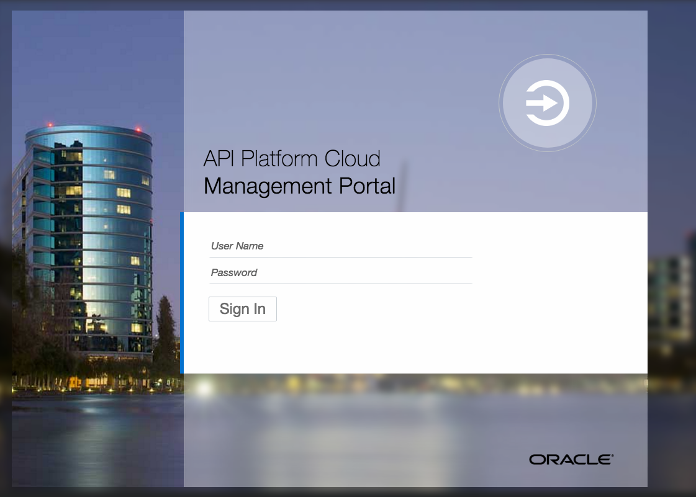
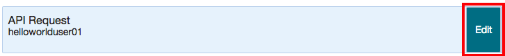
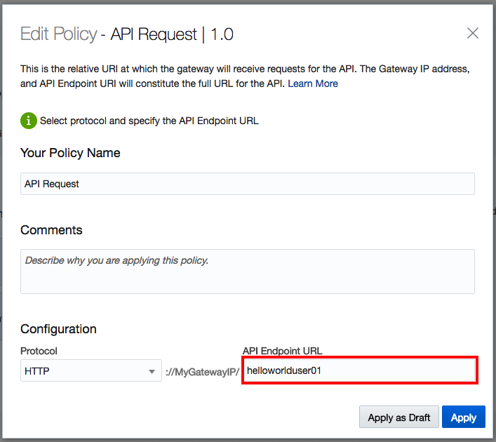

# Lab 200 - API Platfrom Cloud Service
 
## Introduction

This is the second of several labs that are part of the **APIPCS/ICS Development Workshop**. 

In this lab, we will learn how to expose our ICS REST service, created in Lab 100, through the API Platform Cloud Service, enforce policies and share the documentation around our controlled service to developers.

## Objectives

- Apply Policies to API
- Publish API to gateway
- Share documentation to developers

## Required Artifacts

- The following lab and an Oracle Public Cloud account that will be supplied by your instructor.
- Deployment of ICS REST service in Lab 100

## Login to your Oracle Cloud account

### Login to APIPCS Home Page

>***NOTE:*** the **User Name** and **Password** values will be given to you by your instructor. See _Lab 100 **1.1.1**: Login to your Oracle Cloud Account_ for more information on how to sign into the APIPCS home page

  

---

## 1. API Platform Cloud - Management Portal
---

### 1.2 APIs

On the APIs page you have the capability to create new API, edit or look at existing APIs. Let us explore our published ICS REST Service.

  

- **Click** on your `HelloWorldUserXX` API to drill down into the details

  

#### 1.2.1 API Implentation

Let's start with the implementation of our policies:

- Let's confirm our `API Endpoint URL`, **click** on the `Edit` button, when hovering over the `API Request` policy box

  

- Confirm that the `API Endpoint URL` is set to `helloworlduserXX`

  

- Leaving the rest of fields on the defaults, and **click** `Apply`

- Next we are going to inspect the `Service Request`, **click** on the `Edit` button, when hovering over the `Service Request` policy box

  

  - On the left hand side you will see a set of icons:
    - First one, the API Implementation
    - Deployment

