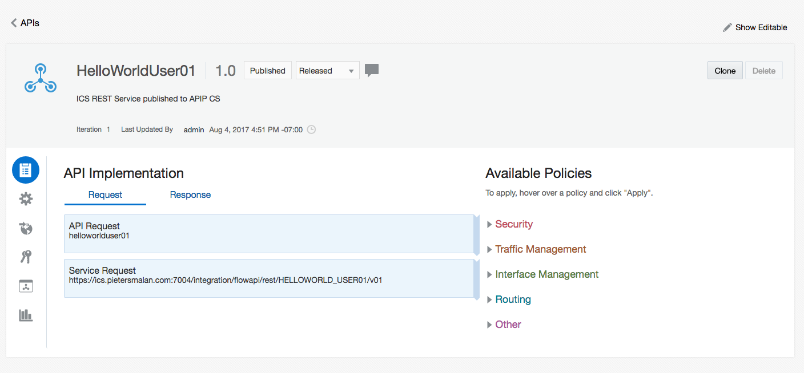

<center></center>

# Lab 200 - API Platfrom Cloud Service
 
## Introduction

This is the second of several labs that are part of the **APIPCS/ICS Development Workshop**. 

In this lab, we will learn how to expose our ICS REST service, created in Lab 100, through the API Platform Cloud Service, enforce policies and share the documentation around our controlled service to developers.

## Objectives

- Apply Policies to API
- Publish API to gateway
- Share documentation to developers

## Required Artifacts

- The following lab and an Oracle Public Cloud account that will be supplied by your instructor.
- Deployment of ICS REST service in Lab 100

## Login to your Oracle Cloud account

### Login to APIPCS Home Page

>***NOTE:*** the **User Name** and **Password** values will be given to you by your instructor. See _Lab 100 **1.1.1**: Login to your Oracle Cloud Account_ for more information on how to sign into the APIPCS home page

  

---

## 1. API Platform Cloud - Management Portal
---


### 1.2 APIs

On the APIs page you have the capability to create new API, edit or look at existing APIs. Let us explore our published ICS REST Service.

  

- **Click** on your `HelloWorldUserXX` API to drill down into the details

  

#### 1.2.1 API Implementation detail
---

Let's start with the implementation of our service:

- Let's confirm our `API Endpoint URL`, **click** on the `Edit` button, when hovering over the `API Request` policy box

  

- Confirm that the `API Endpoint URL` is set to `helloworlduserXX`

  

- Leaving the rest of fields on the defaults, and **click** `Apply`

- Next we are going to inspect the `Service Request`, **click** on the `Edit` button, when hovering over the `Service Request` policy box

  

  We have to specify the service account information for the call, in other words, the authentication for the ICS REST service. Select the predefined `ICS` service account and **click** `Apply`.

  

### 1.2.2 Policy Pipeline
---

#### 1.2.2.1 Key Validation

- On the right hand side, under `Available Policies`, select `Key validation 1.0` and `Apply`

  

- **Click** on the `>` icon to go to the next page, we don't need any changes on this page.

  

- On the second page of the `Apply Policy - Key Validation`, make sure to select the `Header` button and then specify `api-key` as the `Key Header`
  - We specified in this policy that a HTTP Header with name `api-key` should be in the request, set to a valid API Key. When we associate the API with an application, we will have    access to the api key as defined in the application.
  
  

- After **click** apply we a policy pipline as follow:

  

---

> Using the same steps as above, add the following policies.

---

#### 1.2.2.2 Application Rate Limiting

- Under `Available Policies` -> `Traffic Mangement` add `Application Rate Limiting | 1.0`

  

  

  

#### 1.2.2.3 Header Validation

- Under `Available Policies` -> `Interface Mangement` add `Header Validation | 1.0`

  

  

  

#### 1.2.2.4 Interface Filtering

- Under `Available Policies` -> `Interface Mangement` add `Interface Filtering | 1.0`

  

  

  

#### 1.2.2.5 Groovy Scripting

- Under `Available Policies` -> `Other` add `Groovy Script | 1.0`

  

  - Add the following 3 lines in the `Groovy Script` 


  ```groovy
    def clientHeader = context.apiRequest.getHeader("clientHeader")
    def icsHeader = context.apiRequest.getHeader("clientHeader") + "-APIPCS"
    context.serviceRequest.setHeader("icsHeader", icsHeader)
  ```

  

  

----

Apply the changes, by **clicking** the `Save Changes`

  

---